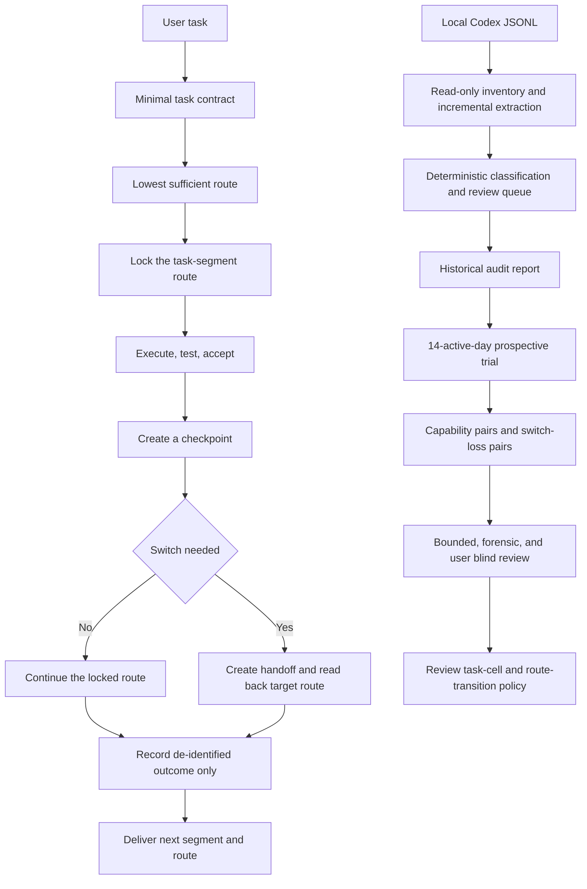

<p align="center">
  
</p>

<p align="center">
  <a href="README.md">简体中文</a> · <a href="SECURITY.md">Security and privacy</a> · <a href="CHANGELOG.md">Changelog</a>
</p>

<h1 align="center">Model Effort Router</h1>

A Codex Skill that recommends one concrete next segment and one exact model-effort route after every delivery

It also provides a local evidence loop for deciding whether Sol was necessary, whether Terra or Luna can sustain later iterations, and which routes consume the weekly allowance

Current version: `0.5.0`

Current status: task-segment locks, verified switch handoffs, switch-loss evaluation, history audit, per-run telemetry, the reversible 14-active-day trial, and a 24-pair blinded evaluator are implemented; four real switch pairs exist locally, but the route verdict remains `indeterminate`, and no private experiment record is published

## What it solves

Using Sol xhigh as a psychological safety default sends research, implementation, testing, correction, and mechanical cleanup through the same expensive route

Downgrading by intuition is unreliable too, because task difficulty, context, verification strength, and user correction all affect outcomes

| Loop | Input | Output | Purpose |
| --- | --- | --- | --- |
| Next-route recommendation | Phase, risk, verification, and failure evidence | One concrete next segment and one exact route | Avoid universal Sol xhigh routing |
| Segment continuity | Frozen contract, active route, and checkpoint | Model lock, switch gate, and verified handoff | Prevent route bouncing inside unfinished work |
| Switch-loss evaluation | Continuation and switched runs from one checkpoint | Recovery cost, missing context, and quality delta | Separate model limits from handoff loss |
| Local evidence | Consented outcomes or local Codex JSONL | Pseudonymized turns, coverage inventory, audit report, and trial status | Separate required Sol use, suspected over-routing, and missing evidence |
| Same-task pairing | A preset route and a high-end control on one frozen task | Blind judgments, capability gaps, and task-cell verdicts | Separate surface similarity from practical equivalence |

## Workflow



Figure 1. Live routing and history audit share the same quality gates

## Default conversation footer

Every normal delivery ends with exactly two lines

```text
下一段：Add a regression test for the failure path
建议模型：Terra medium
```

Model names remain `GPT Pro`, `Sol`, `Terra`, and `Luna`

Rationale, alternatives, run identifiers, and collection status remain hidden unless requested

## Install

Python 3.10 or newer is required, with no runtime dependency outside the standard library

```powershell
python scripts/install_skill.py --dry-run
python scripts/install_skill.py --replace
```

`--replace` is optional for a first installation and required when updating an installed copy

Installation does not enable telemetry or read local history

## First success: audit local history read-only

The output directory must be outside the repository

```powershell
$privateOutput = Join-Path $env:LOCALAPPDATA "model-effort-router\history-analysis"
python scripts/history_audit.py run --output-dir "$privateOutput" --pretty
```

| Command | Result |
| --- | --- |
| `inventory` | Accounts for readable, failed, and source-store entries without persisting paths |
| `extract` | Deduplicates by session and turn, then derives actual routes and cumulative-token deltas |
| `classify` | Applies local deterministic multi-axis rules with zero model calls |
| `review` | Emits only low-confidence, high-risk, mixed-route, and policy-changing cases |
| `report` | Aggregates coverage, routes, effort, tokens, credits, behavior, and counterfactual estimates |
| `prospective` | Initializes and checks a reversible 14-active-day trial |

Unchanged sources use a private derived cache on later runs

See the [history audit policy](references/history-audit-policy.md) for interpretation limits

## Record real task outcomes

Per-run local collection is disabled by default

```powershell
python scripts/telemetry.py enable --pretty
python scripts/telemetry.py start --workspace . --policy guarded_high --task-class routine_implementation --recommended-model terra --recommended-effort medium --actual-model terra --actual-effort medium --context-mode continued --pretty
python scripts/telemetry.py finish --run-id RUN_ID --workspace . --status accepted --tests-run 5 --tests-passed 5 --tests-failed 0 --token-source unavailable --pretty
```

Unavailable token or tool-call counts remain `null`; the collector never guesses or substitutes zero

## Task-segment route lock and switch handoff

A task segment keeps one goal, frozen decisions, allowed scope, baseline, and acceptance contract; one active segment permits one exact model-effort route

The following flow starts a lock, creates a checkpoint and private handoff, verifies the target route, completes the new segment, and writes an aggregate report

```powershell
# Initialize private task-segment state outside the repository
python scripts/segment_guard.py --pretty init

# Choose a private path outside the repository for the content-bearing handoff
$privateHandoff = Join-Path $env:LOCALAPPDATA "model-effort-router\handoffs\current.json"

# Start one Terra high segment with the synthetic contract
python scripts/segment_guard.py --pretty start --project-key PROJECT_KEY --task-key TASK_KEY --phase routine_implementation --execution-shape continuous_iteration --model terra --effort high --contract-file config/example-segment-contract.json

# Confirm that the proposed execution route matches the active lock
python scripts/segment_guard.py --pretty check --segment-id SEGMENT_ID --model terra --effort high

# Create a switch-eligible checkpoint after all mandatory checks pass
python scripts/segment_guard.py --pretty checkpoint --segment-id SEGMENT_ID --contract-file config/example-segment-contract.json --milestone-state passed --mandatory-checks-passed --completed-actions 3 --remaining-items 1

# Write a private handoff packet targeting Sol xhigh
python scripts/segment_guard.py --pretty handoff --segment-id SEGMENT_ID --handoff-file config/example-handoff-contract.json --target-model sol --target-effort xhigh --output "$privateHandoff"

# Read back the target Codex route and create the next segment lock
python scripts/segment_guard.py --pretty accept --segment-id SEGMENT_ID --handoff-id HANDOFF_ID --session-file TARGET_SESSION.jsonl --phase debugging

# Complete the new segment against the same frozen contract
python scripts/segment_guard.py --pretty complete --segment-id NEW_SEGMENT_ID --contract-file config/example-segment-contract.json --status accepted --tests-run 5 --tests-passed 5 --tests-failed 0

# Write aggregate reports without handoff text
python scripts/segment_guard.py --pretty report
```

`check` never claims that a mismatched route is active; `accept` closes the source segment only after exact `turn_context` model and effort readback

See the [task segment continuity policy](references/segment-continuity-policy.md)

## Prospective trial

```powershell
$privateOutput = Join-Path $env:LOCALAPPDATA "model-effort-router\history-analysis"
python scripts/history_audit.py prospective --action init --output-dir "$privateOutput" --pretty
python scripts/history_audit.py prospective --action status --output-dir "$privateOutput" --pretty
```

The first review requires 50 completed runs, 3 projects, 14 active days, 2 comparable routes, and 10 runs per route

These thresholds trigger review and do not claim statistical significance

Any severe defect, scope violation, or downgrade regression immediately reverts the affected task class for manual review

## Small-sample same-task evaluation

The paired evaluator compares the preset and high-end control on the same frozen task instead of treating outcomes from different tasks as model effects

The first experiment is capped at 24 pairs, or 48 model runs; the tool allocates and records experiments but never creates Codex tasks or consumes quota automatically

```powershell
# Initialize the 24-pair budget in the default private directory outside the repository
python scripts/paired_eval.py --pretty init

# Register one routine implementation and randomize anonymous A/B routes
python scripts/paired_eval.py --pretty plan --task-cell routine --phase routine_implementation --task-key CASE_KEY --project-key PROJECT_KEY --baseline-key BASELINE_KEY --execution-shape single_execution --risk-level 1 --verification-strength 3

# Emit a bounded-review contract without model identity
python scripts/paired_eval.py --pretty blind --pair-id PAIR_ID --perspective bounded

# Read actual routes from two Codex sessions and attach completed telemetry
python scripts/paired_eval.py --pretty attach --pair-id PAIR_ID --a-run-id A_RUN_ID --a-session A_SESSION.jsonl --b-run-id B_RUN_ID --b-session B_SESSION.jsonl

# Store a structured judgment that contains no prompt or model output
python scripts/paired_eval.py --pretty judge --pair-id PAIR_ID --input config/example-bounded-judgment.json

# Show budget, task-cell gates, and the next highest-information sample
python scripts/paired_eval.py --pretty status

# Write private aggregate JSON and Markdown reports outside the repository
python scripts/paired_eval.py --pretty report
```

After both routes finish, `attach` requires their telemetry `run_id` values and Codex session JSONL files; it reads only the final model and effort from `turn_context`, then HMAC-pseudonymizes paths and run identifiers

The five allowed conclusions are `preset_sufficient`, `surface_only`, `material_gap`, `both_failed`, and `indeterminate`

`preset_sufficient` requires four practically equivalent pairs across at least two projects and two execution shapes; this is a conservative local routing gate, not statistical proof of universal model equivalence

See the [paired evaluation policy](references/paired-evaluation-policy.md) for the full decision boundary

## Model switch-loss evaluation

The switch evaluator forks one checkpoint into a continuation arm and a switched arm that receives the verified handoff

The public policy caps the experiment at 12 pairs and each exact route transition at 4 pairs; it never creates Codex tasks or duplicates publication, deletion, payment, or production writes

```powershell
# Initialize the private 12-pair switch budget
python scripts/switch_eval.py --pretty init

# Point to the private handoff created by the segment guard
$privateHandoff = Join-Path $env:LOCALAPPDATA "model-effort-router\handoffs\current.json"

# Register one Sol high to Terra high switch pair from a verified private handoff
python scripts/switch_eval.py --pretty plan --task-key CASE_KEY --project-key PROJECT_KEY --checkpoint-key CHECKPOINT_KEY --phase routine_implementation --execution-shape continuous_iteration --source-model sol --source-effort high --target-model terra --target-effort high --handoff-packet "$privateHandoff" --risk-level 1 --verification-strength 3

# Read both actual Codex routes and attach completed telemetry
python scripts/switch_eval.py --pretty attach --pair-id PAIR_ID --a-run-id A_RUN_ID --a-session A_SESSION.jsonl --b-run-id B_RUN_ID --b-session B_SESSION.jsonl

# Emit a route-free bounded-review packet
python scripts/switch_eval.py --pretty blind --pair-id PAIR_ID --perspective bounded

# Store user-visible recovery and correction measurements
python scripts/switch_eval.py --pretty judge --pair-id PAIR_ID --input config/example-switch-bounded-judgment.json

# Store forensic acceptance, missing-context, and five-dimension scores
python scripts/switch_eval.py --pretty judge --pair-id PAIR_ID --input config/example-switch-forensic-judgment.json

# Close unavailable mandatory user review without admitting the pair to the route gate
python scripts/switch_eval.py --pretty resolve-review --pair-id PAIR_ID --disposition unavailable

# Show budget, transition gates, and provisional reversed-retest needs
python scripts/switch_eval.py --pretty status

# Write private aggregate JSON and Markdown reports
python scripts/switch_eval.py --pretty report
```

The allowed results are `no_material_switch_loss`, `recoverable_switch_loss`, `material_switch_loss`, `switch_benefit`, `both_failed`, and `indeterminate`

Material loss and benefit require reversed-order reproduction; policy validation also requires 4 valid pairs across 2 projects and 2 phases

When mandatory user review cannot be obtained, `resolve-review` keeps the pair `indeterminate` and excludes it from the route gate; a later real user judgment can still replace that terminal disposition

See the [switch-loss evaluation policy](references/switch-loss-evaluation-policy.md)

## Default routing matrix

| Next segment | Recommended route |
| --- | --- |
| Important external research | GPT Pro |
| Architecture convergence or high-impact adjudication | Sol high |
| Hard-gate irreversible decision or two independent failed hypotheses | Sol xhigh |
| Routine implementation | Terra medium |
| Cross-module complex implementation | Terra high |
| Frozen objective with complex detail | Terra xhigh |
| Translation, formatting, bulk cleanup, or fixed tests | Luna medium |

`xhigh` is reserved for conflicting evidence, two failed independent hypotheses, high irreversibility with weak verification, security or data-boundary changes, and final high-value red-team review

## Privacy and trust boundary

- Source JSONL is read in place and never copied or modified
- Prompts, responses, code, patches, logs, file names, paths, URLs, email addresses, accounts, and secrets never enter derived records
- Source text exists only in memory during deterministic classification; persisted summaries use fixed labels
- Session, turn, and project identifiers are HMAC pseudonyms derived with a machine-local salt
- Mixed-route turns retain total usage but are excluded from fair route comparison
- ChatGPT conversations without model and token metadata may inform behavior categories but never model-cost comparisons
- Paired blind review stores only fixed scores, controlled acceptance flags, and HMAC pseudonyms; raw tasks and results remain in their Codex tasks
- Segment state stores only contract and handoff digests, fixed checkpoints, and routes; handoff text is written only to an explicitly named private file outside the repository
- Switch evaluation stores recovery time, repeated actions, correction counts, missing-context counts, fixed scores, and route readback without copying handoff text
- The public repository contains generic code, synthetic tests, and blank policy only

See the [telemetry policy](references/telemetry-policy.md), [history audit policy](references/history-audit-policy.md), and [security policy](SECURITY.md)

## Validate

```powershell
python scripts/validate_package.py
python -m unittest discover -s tests -v
python -m compileall -q scripts tests
```

The CI matrix targets Python 3.10 through 3.13; local acceptance covers cumulative-token deltas, damaged JSONL, mixed routes, cache reuse, zero source mutation, privacy scanning, pre-trial exclusion, segment locks, handoff digests, target-route readback, randomized A/B, reversed retests, and both blind-review gates

Historical observation describes what happened and does not establish model causality

## Repository structure

```text
model-effort-router/
├── SKILL.md                         # Delivery footer and internal execution loop
├── scripts/history_audit.py         # Full history audit and prospective trial
├── scripts/paired_eval.py           # Same-task pairing, route readback, blind review, and sequential stopping
├── scripts/segment_guard.py         # Task-segment locks, checkpoints, and handoff acceptance
├── scripts/switch_eval.py           # Continuation-versus-switch loss evaluation
├── scripts/telemetry.py             # Consented per-run local records
├── scripts/recommend.py             # Deterministic route recommendation
├── config/                          # Model prices, examples, and review gates
├── schemas/                         # Route, telemetry, and audit contracts
├── references/                      # Routing, privacy, and observation policies
├── tests/                           # Synthetic unit and end-to-end tests
└── docs/                            # Decision audit and local visual asset
```

## Evidence boundary

Public model routers predate this project, so it makes no originality claim

The toolchain, local trial, capability pairing, and switch-loss evaluator are implemented; four real switch pairs exist locally, but unavailable mandatory user review leaves the transition `indeterminate`, causal quality differences and route-transition costs are not validated, and `likely_overrouted` is never presented as `lower_route_validated`

See the [decision audit](docs/DECISION_AUDIT.md)

## Contributing and license

Read [CONTRIBUTING.md](CONTRIBUTING.md) before contributing

Use GitHub private vulnerability reporting for security or privacy issues, and never attach local derived records to a public issue

Licensed under the [MIT License](LICENSE)

## Official references

- [Codex App Server](https://learn.chatgpt.com/docs/app-server)
- [Codex pricing](https://learn.chatgpt.com/docs/pricing)
- [OpenAI model guidance](https://developers.openai.com/api/docs/guides/latest-model)
- [OpenAI Graders](https://developers.openai.com/api/reference/resources/graders)
