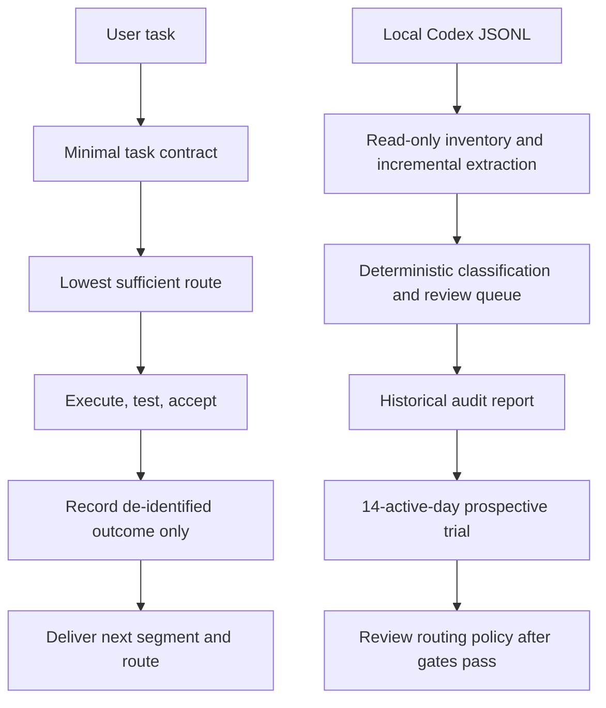

<p align="center">
  
</p>

<p align="center">
  <a href="README.md">简体中文</a> · <a href="SECURITY.md">Security and privacy</a> · <a href="CHANGELOG.md">Changelog</a>
</p>

# Model Effort Router

A Codex Skill that recommends one concrete next segment and one exact model-effort route after every delivery

It also provides a local evidence loop for deciding whether Sol was necessary, whether Terra or Luna can sustain later iterations, and which routes consume the weekly allowance

Current version: `0.3.0`

Current status: history audit, per-run telemetry, and a reversible 14-active-day prospective trial are implemented; causal model-quality differences remain unverified

## What it solves

Using Sol xhigh as a psychological safety default sends research, implementation, testing, correction, and mechanical cleanup through the same expensive route

Downgrading by intuition is unreliable too, because task difficulty, context, verification strength, and user correction all affect outcomes

| Loop | Input | Output | Purpose |
| --- | --- | --- | --- |
| Next-route recommendation | Phase, risk, verification, and failure evidence | One concrete next segment and one exact route | Avoid universal Sol xhigh routing |
| Local evidence | Consented outcomes or local Codex JSONL | Pseudonymized turns, coverage inventory, audit report, and trial status | Separate required Sol use, suspected over-routing, and missing evidence |

## Workflow



Figure 1. Live routing and history audit share the same quality gates

## Default conversation footer

Every normal delivery ends with exactly two lines

```text
下一段：Add a regression test for the failure path
建议模型：Terra medium
```

Model names remain `GPT Pro`, `Sol`, `Terra`, and `Luna`

Rationale, alternatives, run identifiers, and collection status remain hidden unless requested

## Install

Python 3.10 or newer is required, with no runtime dependency outside the standard library

```powershell
python scripts/install_skill.py --dry-run
python scripts/install_skill.py --replace
```

`--replace` is optional for a first installation and required when updating an installed copy

Installation does not enable telemetry or read local history

## First success: audit local history read-only

The output directory must be outside the repository

```powershell
$privateOutput = Join-Path $env:LOCALAPPDATA "model-effort-router\history-analysis"
python scripts/history_audit.py run --output-dir "$privateOutput" --pretty
```

| Command | Result |
| --- | --- |
| `inventory` | Accounts for readable, failed, and source-store entries without persisting paths |
| `extract` | Deduplicates by session and turn, then derives actual routes and cumulative-token deltas |
| `classify` | Applies local deterministic multi-axis rules with zero model calls |
| `review` | Emits only low-confidence, high-risk, mixed-route, and policy-changing cases |
| `report` | Aggregates coverage, routes, effort, tokens, credits, behavior, and counterfactual estimates |
| `prospective` | Initializes and checks a reversible 14-active-day trial |

Unchanged sources use a private derived cache on later runs

See the [history audit policy](references/history-audit-policy.md) for interpretation limits

## Record real task outcomes

Per-run local collection is disabled by default

```powershell
python scripts/telemetry.py enable --pretty
python scripts/telemetry.py start --workspace . --policy guarded_high --task-class routine_implementation --recommended-model terra --recommended-effort medium --actual-model terra --actual-effort medium --context-mode continued --pretty
python scripts/telemetry.py finish --run-id RUN_ID --workspace . --status accepted --tests-run 5 --tests-passed 5 --tests-failed 0 --token-source unavailable --pretty
```

Unavailable token or tool-call counts remain `null`; the collector never guesses or substitutes zero

## Prospective trial

```powershell
$privateOutput = Join-Path $env:LOCALAPPDATA "model-effort-router\history-analysis"
python scripts/history_audit.py prospective --action init --output-dir "$privateOutput" --pretty
python scripts/history_audit.py prospective --action status --output-dir "$privateOutput" --pretty
```

The first review requires 50 completed runs, 3 projects, 14 active days, 2 comparable routes, and 10 runs per route

These thresholds trigger review and do not claim statistical significance

Any severe defect, scope violation, or downgrade regression immediately reverts the affected task class for manual review

## Default routing matrix

| Next segment | Recommended route |
| --- | --- |
| Important external research | GPT Pro |
| Architecture convergence or high-impact adjudication | Sol high |
| Hard-gate irreversible decision or two independent failed hypotheses | Sol xhigh |
| Routine implementation | Terra medium |
| Cross-module complex implementation | Terra high |
| Frozen objective with complex detail | Terra xhigh |
| Translation, formatting, bulk cleanup, or fixed tests | Luna medium |

`xhigh` is reserved for conflicting evidence, two failed independent hypotheses, high irreversibility with weak verification, security or data-boundary changes, and final high-value red-team review

## Privacy and trust boundary

- Source JSONL is read in place and never copied or modified
- Prompts, responses, code, patches, logs, file names, paths, URLs, email addresses, accounts, and secrets never enter derived records
- Source text exists only in memory during deterministic classification; persisted summaries use fixed labels
- Session, turn, and project identifiers are HMAC pseudonyms derived with a machine-local salt
- Mixed-route turns retain total usage but are excluded from fair route comparison
- ChatGPT conversations without model and token metadata may inform behavior categories but never model-cost comparisons
- The public repository contains generic code, synthetic tests, and blank policy only

See the [telemetry policy](references/telemetry-policy.md), [history audit policy](references/history-audit-policy.md), and [security policy](SECURITY.md)

## Validate

```powershell
python scripts/validate_package.py
python -m unittest discover -s tests -v
python -m compileall -q scripts tests
```

Version `0.3.0` is tested on Python 3.10 through 3.13, including cumulative-token deltas, damaged JSONL, mixed routes, cache reuse, zero source mutation, privacy scanning, and prospective rollback

Historical observation describes what happened and does not establish model causality

## Repository structure

```text
model-effort-router/
├── SKILL.md                         # Delivery footer and internal execution loop
├── scripts/history_audit.py         # Full history audit and prospective trial
├── scripts/telemetry.py             # Consented per-run local records
├── scripts/recommend.py             # Deterministic route recommendation
├── config/                          # Model prices, examples, and review gates
├── schemas/                         # Route, telemetry, and audit contracts
├── references/                      # Routing, privacy, and observation policies
├── tests/                           # Synthetic unit and end-to-end tests
└── docs/                            # Decision audit and local visual asset
```

## Evidence boundary

Public model routers predate this project, so it makes no originality claim

The toolchain and local trial are implemented, but causal quality differences between Sol, Terra, and Luna are not validated, and `likely_overrouted` is never presented as `lower_route_validated`

See the [decision audit](docs/DECISION_AUDIT.md)

## Contributing and license

Read [CONTRIBUTING.md](CONTRIBUTING.md) before contributing

Use GitHub private vulnerability reporting for security or privacy issues, and never attach local derived records to a public issue

Licensed under the [MIT License](LICENSE)

## Official references

- [Codex App Server](https://learn.chatgpt.com/docs/app-server)
- [Codex pricing](https://learn.chatgpt.com/docs/pricing)
