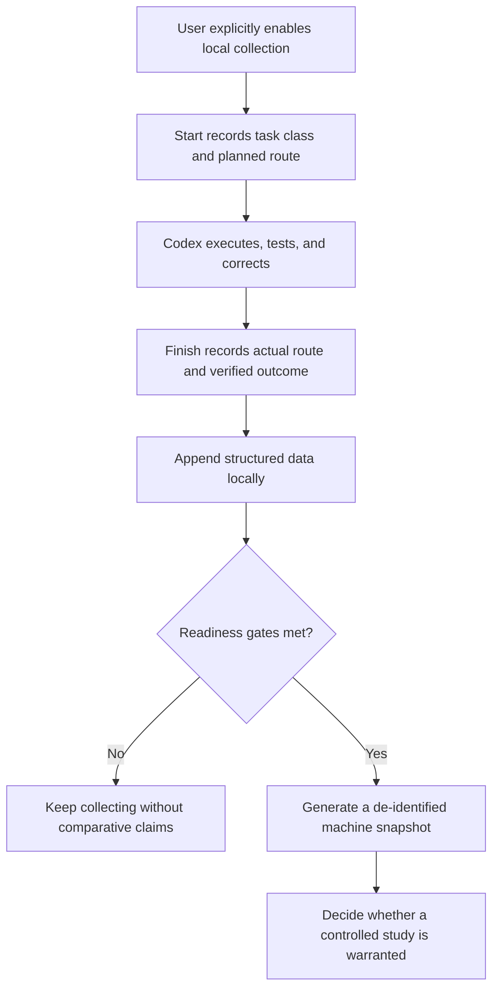

<p align="center">
  
</p>

<p align="center">
  <a href="README.md">简体中文</a> ·
  <a href="SECURITY.md">Security and privacy</a> ·
  <a href="CHANGELOG.md">Changelog</a>
</p>

# Model Effort Router

A Codex Skill for routing long-running project work across model and reasoning-effort tiers. Version `0.2.0` is a public telemetry-first pilot: it gathers consented local execution statistics before making comparative claims about Sol, Terra, Luna, medium, high, or xhigh.

## 1 Why this exists

Using Sol xhigh as a universal safety default spends high-cost reasoning on work with very different risk profiles. Downgrading by intuition creates the opposite problem: isolated failures can look like stable capability gaps.

This project separates recommendation from evidence. The router proposes an explainable route for the next iteration. The telemetry lifecycle records the route actually used and the verified outcome. Only after explicit readiness gates are met can the user generate a de-identified whole-machine snapshot.

## 2 Workflow



Figure 1. Real-project observation and later analysis flow

## 3 Privacy boundary

Collection is disabled by default. It never stores prompts, responses, source code, patches, logs, file names, file paths, remote URLs, branch names, commit messages, usernames, or email addresses.

Raw local records contain fixed categories, counts, boolean outcomes, timestamps, and project and machine pseudonyms derived with a machine-local random salt. Public snapshots remove even those pseudonyms and exact timestamps. Groups with fewer than five runs expose counts only, with rates suppressed.

See the [telemetry policy](references/telemetry-policy.md) and [security policy](SECURITY.md) for the complete field and threat boundary.

## 4 Install

```powershell
# Preview the exact destination without modifying the Codex Skill directory.
python scripts/install_skill.py --dry-run

# Install the runtime files after reviewing the destination.
python scripts/install_skill.py
```

Installation does not enable collection.

## 5 Enable collection

```powershell
# Review the policy and explicitly enable local collection.
python scripts/telemetry.py enable --pretty

```

Installation and enablement do not create a project observation.

## 6 Record a real task

```powershell
# Start a real routine-implementation observation.
python scripts/telemetry.py start --workspace . --policy guarded_high --task-class routine_implementation --recommended-model terra --recommended-effort medium --actual-model terra --actual-effort medium --context-mode compressed_handoff --pretty

# Finish the same observation using the run identifier returned by start.
python scripts/telemetry.py finish --run-id RUN_ID --workspace . --status accepted --tests-run 5 --tests-passed 5 --tests-failed 0 --rework-minutes 12 --token-source unavailable --pretty
```

Unavailable token and tool-call counts remain `null`; the collector does not estimate them from text length.

## 7 Routing presets

Table 1. Preset scope

<div align="center">

| Preset | Intended use | Main constraint |
| --- | --- | --- |
| `quality_first` | Architecture, irreversible decisions, final red-team review | Sol xhigh requires explicit high-risk evidence |
| `guarded_high` | Recommended baseline for long-running projects | Routine implementation starts at Terra medium or high and escalates on evidence |
| `balanced` | Low-risk work with strong verification | Prefer Terra or Luna and reserve Sol for adjudication |

</div>

```powershell
# Produce a deterministic next-iteration recommendation from a structured task contract.
python scripts/recommend.py --input config/example-task.json --pretty
```

## 8 Snapshot readiness

The default review gates are 50 completed runs, 3 projects, 14 active days, 2 compared routes, and 10 runs per compared route. These are operational review triggers, not a statistical-power claim.

```powershell
# Show readiness and the remaining gap for each gate.
python scripts/telemetry.py status --pretty

# Generate a de-identified snapshot at a user-selected safe path.
python scripts/telemetry.py snapshot --output OUTPUT_PATH --pretty
```

The snapshot remains observational. Task mix, Skill-selection effects, and host-visible fields can bias it. Causal high-versus-xhigh comparisons require a separately authorized paired or randomized crossover design.

## 9 Stop or delete

```powershell
# Stop future collection while retaining local records for inspection.
python scripts/telemetry.py disable --pretty

# Permanently remove the local telemetry directory after reviewing status.
python scripts/telemetry.py purge --confirm PURGE-LOCAL-TELEMETRY --pretty
```

Deletion is irreversible.

## 10 Validate

```powershell
# Validate package structure, privacy invariants, documentation, and automation entry points.
python scripts/validate_package.py

# Run unit and command-line end-to-end tests.
python -m unittest discover -s tests -v

# Verify that all Python sources compile.
python -m compileall -q scripts tests
```

The runtime uses only the Python standard library and supports Python 3.10 or newer.

## 11 Repository structure

```text
model-effort-router/
├── SKILL.md                         # Skill lifecycle and routing contract.
├── agents/openai.yaml               # Codex presentation metadata.
├── config/                          # Routing examples and review gates.
├── schemas/                         # Input, output, outcome, and telemetry schemas.
├── scripts/                         # Routing, telemetry, installation, and validation.
├── references/                      # Routing, telemetry, and observation policies.
├── tests/                           # Unit and command-line lifecycle tests.
└── docs/                            # Decision audit and local visual asset.
```

## 12 Evidence boundary

Public model routers predate this repository, so the project makes no “first” or “unique router” claim. Its present focus is a consented, privacy-minimized execution lifecycle with verified outcomes and explicit whole-machine readiness gates. See the [decision audit](docs/DECISION_AUDIT.md).

No model win rate, cost multiplier, or universal best-effort claim will be published before enough real observations exist.

## 13 Contributing and license

Read [CONTRIBUTING.md](CONTRIBUTING.md) before opening a change. Report security and privacy issues through GitHub private vulnerability reporting; never attach raw telemetry to a public issue.

Licensed under the [MIT License](LICENSE).

## 14 References

[1] OpenAI, “Using GPT-5.6,” OpenAI Developer Documentation, 2026. [Online]. Available: https://developers.openai.com/api/docs/guides/latest-model

[2] OpenAI, “GPT-5.6,” OpenAI Developer Documentation, 2026. [Online]. Available: https://developers.openai.com/api/docs/models/gpt-5.6
