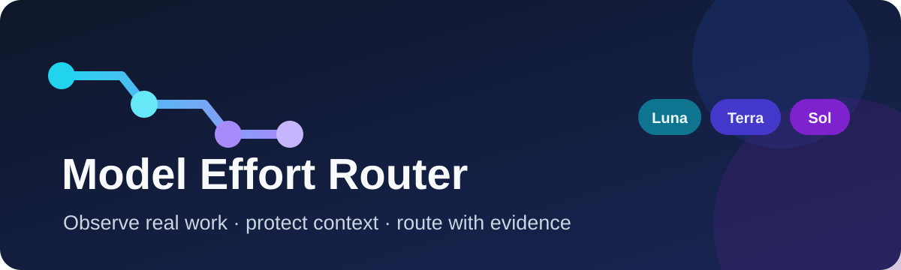
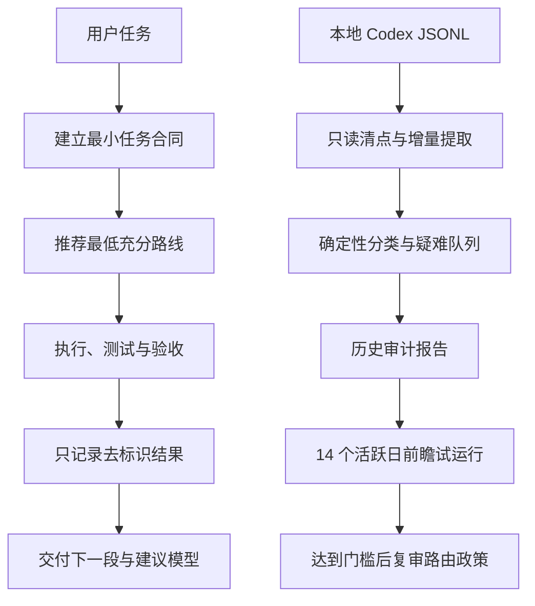

<p align="center">
  
</p>

<p align="center">
  <a href="README.en.md">English</a> · <a href="SECURITY.md">安全与隐私</a> · <a href="CHANGELOG.md">变更记录</a>
</p>

# Model Effort Router

一个面向 Codex 长流程项目的模型与推理档位路由 Skill

它在每轮交付后只给出下一段任务和建议路线，同时用本机数据回答三个问题：Sol 是否真的必要、Terra 或 Luna 能否稳定接管后续迭代、周额度被哪些任务和档位消耗

当前版本：`0.3.1`

当前状态：历史审计、逐轮记录和 14 个活跃日前瞻试运行均已实现，模型因果差异仍未验证

## 它解决什么问题

长期把 Sol xhigh 当成心理保险，会让调查、实现、测试、修正和机械整理共享同一条高成本路线

仅凭主观印象降档也不可靠，因为任务难度、上下文、验证强度和用户纠偏都会影响结果

| 闭环 | 输入 | 输出 | 用途 |
| --- | --- | --- | --- |
| 下一轮路由 | 项目阶段、风险、验证能力和失败证据 | 一个具体下一段与一个精确模型档位 | 避免每轮都使用 Sol xhigh |
| 本机证据 | 经授权的运行结果或本地 Codex JSONL | 去标识轮次、覆盖清单、审计报告和试运行状态 | 区分真实需求、疑似过度路由和证据不足 |

## 工作流



图 1　实时路由与历史审计共享同一套质量门

## 默认对话收尾

每轮正常交付末尾只追加两行

```text
下一段：为失败路径增加回归测试
建议模型：Terra medium
```

模型名称始终使用 `GPT Pro`、`Sol`、`Terra` 和 `Luna`

路由理由、备选路线、运行标识和采集状态默认不展示，用户明确询问时再展开

## 安装

需要 Python 3.10 或更高版本，运行时只使用 Python 标准库

```powershell
python scripts/install_skill.py --dry-run
python scripts/install_skill.py --replace
```

首次安装可以省略 `--replace`，更新已安装版本时保留该参数

安装不会自动启用统计，也不会读取历史

## 第一次成功：只读审计本地历史

输出目录必须位于仓库外，下面示例使用当前账户的本机应用数据目录

```powershell
$privateOutput = Join-Path $env:LOCALAPPDATA "model-effort-router\history-analysis"
python scripts/history_audit.py run --output-dir "$privateOutput" --pretty
```

一次 `run` 顺序执行完整流水线

| 命令 | 结果 |
| --- | --- |
| `inventory` | 列出发现、可读、失败和来源类型，不保存源路径 |
| `extract` | 按 session 与 turn 去重，提取实际路线和累计 token 增量 |
| `classify` | 使用本地确定性规则生成多轴任务标签，模型调用为 0 |
| `review` | 只输出低置信度、高风险、混合路线和会改变政策的疑难项 |
| `report` | 汇总覆盖、路线、effort、token、credits、行为模式和反事实估算 |
| `prospective` | 建立并检查 14 个活跃日的可回滚试运行 |

第二次运行会复用未变化来源的私有派生缓存，只重读新增或修改过的 JSONL

逐项解释见 [历史审计政策](references/history-audit-policy.md)

## 在真实任务中记录结果

本地逐轮采集默认关闭

```powershell
python scripts/telemetry.py enable --pretty
python scripts/telemetry.py start --workspace . --policy guarded_high --task-class routine_implementation --recommended-model terra --recommended-effort medium --actual-model terra --actual-effort medium --context-mode continued --pretty
python scripts/telemetry.py finish --run-id RUN_ID --workspace . --status accepted --tests-run 5 --tests-passed 5 --tests-failed 0 --token-source unavailable --pretty
```

宿主没有提供 token 或工具调用计数时保持 `null`，不会用字符数猜测，也不会用零冒充实测

## 前瞻试运行

```powershell
$privateOutput = Join-Path $env:LOCALAPPDATA "model-effort-router\history-analysis"
python scripts/history_audit.py prospective --action init --output-dir "$privateOutput" --pretty
python scripts/history_audit.py prospective --action status --output-dir "$privateOutput" --pretty
```

第一次政策复审需要至少 50 次完成记录、3 个项目、14 个活跃日、2 条可比较路线，并且每条路线至少 10 次

这些数字只触发复审，不代表统计显著性

出现严重缺陷、范围违规或降档回归时，受影响任务类别立即回到上一档并进入人工复核

## 默认路由矩阵

| 下一段任务 | 建议路线 |
| --- | --- |
| 重要外部调查 | GPT Pro |
| 架构收敛和高影响裁决 | Sol high |
| 命中硬门的不可逆裁决或两个独立假设失败 | Sol xhigh |
| 日常实现 | Terra medium |
| 跨模块复杂实现 | Terra high |
| 目标冻结但细节复杂 | Terra xhigh |
| 翻译、格式转换、批量整理和固定测试 | Luna medium |

`xhigh` 不是心理保险，只有证据冲突、两个不同假设失败、高不可逆弱验证、安全或数据边界改变、最终高价值红队等硬门才升级

## 隐私与信任边界

- 原始 JSONL 原地只读，分析器不会复制或改写历史
- 提示词、回复、代码、补丁、日志、文件名、路径、URL、邮箱、账号和秘密不进入派生记录
- 原文只在进程内存中短暂参与确定性分类，落盘摘要由固定分类标签组成
- session、turn 和 project 使用本机随机盐生成 HMAC 化名
- 混合路线保留总用量，但排除在公平路线比较之外
- ChatGPT 对话缺少模型与 token 元数据时，只参与行为画像，不参与模型成本比较
- 公开仓库只包含通用代码、合成测试和空白政策，不包含个人统计

完整边界见 [遥测政策](references/telemetry-policy.md)、[历史审计政策](references/history-audit-policy.md) 和 [安全政策](SECURITY.md)

## 验证

```powershell
python scripts/validate_package.py
python -m unittest discover -s tests -v
python -m compileall -q scripts tests
```

版本 `0.3.1` 验收覆盖 Python 3.10 至 3.13，并包含累计 token 跨轮差分、损坏 JSONL、混合路线、增量缓存、源文件零改写、隐私扫描、试运行前记录排除和前瞻回退测试

历史观察只能说明发生过什么，不能证明模型造成了质量差异

## 仓库结构

```text
model-effort-router/
├── SKILL.md                         # 每轮交付协议与内部执行闭环
├── scripts/history_audit.py         # 全量历史审计和前瞻试运行
├── scripts/telemetry.py             # 经同意的逐轮本地记录
├── scripts/recommend.py             # 确定性路由建议
├── config/                          # 模型价格、示例和复审门槛
├── schemas/                         # 路由、遥测和审计记录契约
├── references/                      # 路由、隐私和观察政策
├── tests/                           # 合成数据单元与端到端测试
└── docs/                            # 决策审计和本地视觉资源
```

## 证据边界

公开模型路由器早于本项目存在，因此本项目不声称首创

当前已经实现工具链和本机试运行，尚未验证 Sol、Terra 与 Luna 的因果质量差异，也不会把 `likely_overrouted` 写成已经证明的 `lower_route_validated`

详细决策边界见 [决策审计](docs/DECISION_AUDIT.md)

## 参与和许可

提交修改前请阅读 [贡献指南](CONTRIBUTING.md)

安全或隐私问题请使用 GitHub 私密漏洞报告，不要在公开 Issue 中附带本机派生记录

项目采用 [MIT License](LICENSE)

## 官方依据

- [Codex App Server](https://learn.chatgpt.com/docs/app-server)
- [Codex pricing](https://learn.chatgpt.com/docs/pricing)
