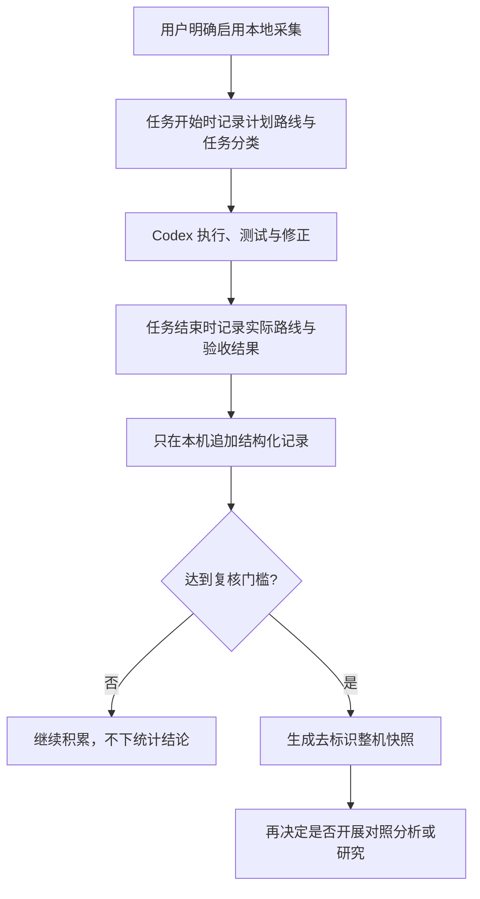

<p align="center">
  
</p>

<p align="center">
  <a href="README.en.md">English</a> ·
  <a href="SECURITY.md">安全与隐私</a> ·
  <a href="CHANGELOG.md">变更记录</a>
</p>

# Model Effort Router

一个面向 Codex 长流程项目的模型与推理档位路由 Skill。当前版本先收集经用户同意的真实执行统计，再用本机数据回答 Sol、Terra、Luna 以及 medium、high、xhigh 在不同任务上的质量、返工和消耗差异。

当前版本：`0.2.0`。当前阶段：公开试点，不构建研究论文，也不宣称已经证明某个模型更优。

## 1 项目为什么存在

长期把 Sol xhigh 当成安全默认值，会让高成本推理覆盖调查、实现、测试、修复和机械整理等性质不同的工作。反过来，仅凭主观印象降低档位，也容易把偶发失败误判成稳定差距。

本项目把这两个问题拆开：路由器给下一轮提出可解释建议，遥测工具记录最终实际路线和可验证结果。积累达到复核门槛后，再生成不含项目身份的整机汇总快照。

## 2 当前工作流



图 1 真实项目观测与后续分析流程

## 3 隐私边界

采集默认关闭。启用后，工具也不会保存提示词、回复正文、源代码、补丁、日志、文件名、文件路径、仓库远程地址、Git 分支名、提交信息、用户名或电子邮件。

本地原始记录只包含固定枚举、计数、布尔验收结果、时间戳，以及使用本机随机盐生成的项目和机器伪标识。公开快照会进一步移除伪标识和精确时间；样本少于 5 次的分组只显示样本量，不显示成功率和缺陷率。

完整字段与威胁边界见 [遥测政策](references/telemetry-policy.md) 和 [安全政策](SECURITY.md)。

## 4 安装

仓库提供安装脚本，先预览目标，再复制运行所需文件。

```powershell
# 第一步：预览安装目标，不修改本机 Skill 目录。
python scripts/install_skill.py --dry-run

# 第二步：确认目标正确后安装。
python scripts/install_skill.py
```

默认安装位置是 Codex Home 下的 `skills/model-effort-router`。脚本不会复制测试、审计资料或本地遥测数据。

## 5 第一次启用

安装本身不会启动采集。用户需要单独确认本地采集政策。

```powershell
# 第一步：显示将要接受的隐私边界和数据目录。
python scripts/telemetry.py enable --pretty

# 第二步：查看当前授权状态和积累进度。
python scripts/telemetry.py status --pretty
```

随时可以停止后续写入：

```powershell
# 停止新的遥测记录，保留既有本地数据供用户检查。
python scripts/telemetry.py disable --pretty
```

## 6 在真实任务中记录

Skill 会把记录动作纳入固定生命周期。任务开始命令返回 `run_id`；结束时必须使用同一个标识。

```powershell
# 开始一次常规实现任务；workspace 只用于生成本机伪标识，不会写入记录。
python scripts/telemetry.py start --workspace . --policy guarded_high --task-class routine_implementation --recommended-model terra --recommended-effort medium --actual-model terra --actual-effort medium --context-mode compressed_handoff --pretty

# 任务完成后写入实际路线和验收结果；把 RUN_ID 替换为开始命令返回的值。
python scripts/telemetry.py finish --run-id RUN_ID --workspace . --status accepted --tests-run 5 --tests-passed 5 --tests-failed 0 --rework-minutes 12 --token-source unavailable --pretty
```

宿主没有提供 token 或工具调用计数时，字段保持 `null`。工具不会用字符数猜测 token，也不会把未知值写成零。

## 7 路由预设

表 1 三种预设的适用范围

<div align="center">

| 预设 | 适用场景 | 核心约束 |
| --- | --- | --- |
| `quality_first` | 首轮架构、不可逆决策、最终红队审查 | 允许 Sol xhigh，但每次都要求高风险证据 |
| `guarded_high` | 一般长期项目的建议默认值 | 常规实现从 Terra medium 或 high 开始，失败触发升级 |
| `balanced` | 低风险、强验证、批量工作 | 优先 Terra 或 Luna，把 Sol 留给裁决与高风险任务 |

</div>

推荐下一轮路线：

```powershell
# 根据结构化任务合同生成下一轮模型和推理档位建议。
python scripts/recommend.py --input config/example-task.json --pretty
```

`xhigh` 不是心理保险。只有架构仍未收敛、两个独立假设均失败、安全或数据边界变化、跨模块且验证能力弱、最终红队审查等证据出现时，路由器才建议升级。

## 8 何时生成整机快照

以下门槛是“值得复核”的运行条件，不代表统计显著性：完成运行至少 50 次、覆盖至少 3 个项目、跨越至少 14 个活跃日、至少比较 2 条路线，并且每条被比较路线至少 10 次。

```powershell
# 查看是否达到复核门槛以及各项差距。
python scripts/telemetry.py status --pretty

# 达到门槛后生成去标识快照；OUTPUT_PATH 应位于用户选择的安全目录。
python scripts/telemetry.py snapshot --output OUTPUT_PATH --pretty
```

快照仍然只是观察性描述。不同任务难度、Skill 调用选择和宿主可见字段会造成偏差。要比较 high 与 xhigh 的因果差异，仍需另行授权并设计配对或随机交叉实验。

## 9 停止采集和删除数据

```powershell
# 紧急停止本次进程及其子进程中的遥测写入。
$env:MODEL_EFFORT_ROUTER_TELEMETRY = "off" # 在当前 PowerShell 会话中停止遥测写入。

# 永久删除本地遥测目录；命令要求输入固定确认短语。
python scripts/telemetry.py purge --confirm PURGE-LOCAL-TELEMETRY --pretty
```

删除无法撤销。执行前请先运行 `status`，确认显示的数据目录属于本项目。

## 10 验证仓库

```powershell
# 验证 Skill 结构、隐私约束、文档和自动化入口。
python scripts/validate_package.py

# 运行全部单元测试和命令行端到端测试。
python -m unittest discover -s tests -v

# 验证 Python 文件能够编译。
python -m compileall -q scripts tests
```

项目运行时只依赖 Python 标准库，支持 Python 3.10 及以上版本。

## 11 仓库结构

```text
model-effort-router/
├── SKILL.md                         # Skill 执行入口与固定生命周期。
├── agents/openai.yaml               # Codex 展示信息与默认调用提示。
├── config/                          # 路由目录、示例和观测门槛。
├── schemas/                         # 输入、输出、结果和遥测 JSON Schema。
├── scripts/                         # 路由、遥测、安装与验证工具。
├── references/                      # 路由政策、遥测政策和观测协议。
├── tests/                           # 单元测试与端到端测试。
└── docs/                            # 决策审计和本地视觉资产。
```

## 12 当前证据边界

公开仓库中的其他路由器已经说明“按任务选择模型”并非本项目首创。本项目当前聚焦于经用户同意、隐私最小化、可验证结束状态和整机复核门槛的闭环。详细结论审计见 [决策审计](docs/DECISION_AUDIT.md)。

在真实数据达到门槛前，本项目不会发布模型胜率、成本倍率或“最佳默认档位”结论。

## 13 参与和许可

提交问题前请阅读 [贡献指南](CONTRIBUTING.md)。安全或隐私问题请使用 GitHub 私密漏洞报告，不要在公开 Issue 中附带遥测记录。

项目采用 [MIT License](LICENSE)。

## 14 参考资料

[1] OpenAI, “Using GPT-5.6,” OpenAI Developer Documentation, 2026. [Online]. Available: https://developers.openai.com/api/docs/guides/latest-model

[2] OpenAI, “GPT-5.6,” OpenAI Developer Documentation, 2026. [Online]. Available: https://developers.openai.com/api/docs/models/gpt-5.6
