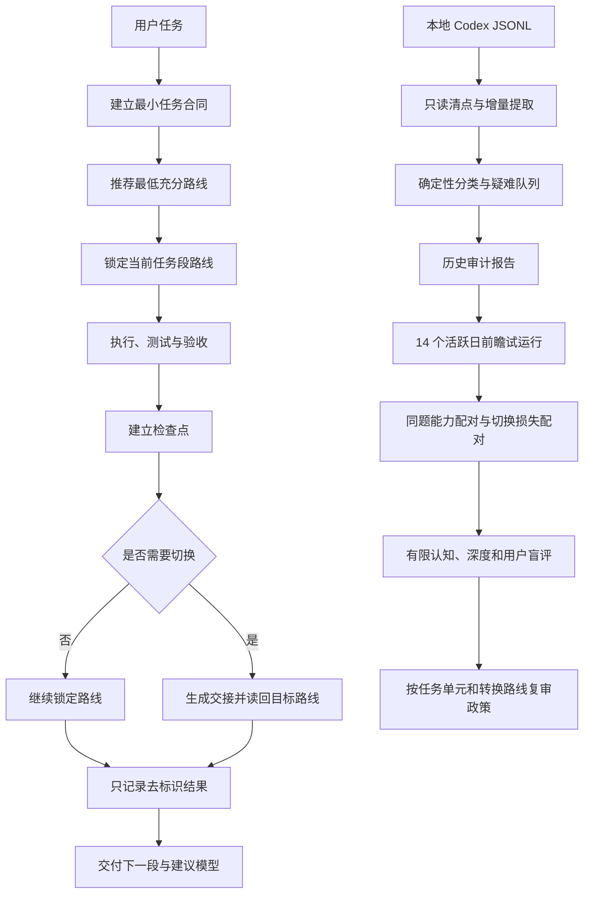

<p align="center">
  
</p>

<p align="center">
  <a href="README.en.md">English</a> · <a href="SECURITY.md">安全与隐私</a> · <a href="CHANGELOG.md">变更记录</a>
</p>

# Model Effort Router

一个面向 Codex 长流程项目的模型与推理档位路由 Skill

它在每轮交付后只给出下一段任务和建议路线，同时用本机数据回答三个问题：Sol 是否真的必要、Terra 或 Luna 能否稳定接管后续迭代、周额度被哪些任务和档位消耗

当前版本：`0.5.0`

当前状态：任务段模型锁、切换交接、切换损失评测、历史审计、逐轮记录、14 个活跃日前瞻试运行和最多 24 对任务的同题盲评均已实现；本机已有 4 对真实切换样本，但路线结论仍为 `indeterminate`，公开仓库不包含私人实验记录

## 它解决什么问题

长期把 Sol xhigh 当成心理保险，会让调查、实现、测试、修正和机械整理共享同一条高成本路线

仅凭主观印象降档也不可靠，因为任务难度、上下文、验证强度和用户纠偏都会影响结果

| 闭环 | 输入 | 输出 | 用途 |
| --- | --- | --- | --- |
| 下一轮路由 | 项目阶段、风险、验证能力和失败证据 | 一个具体下一段与一个精确模型档位 | 避免每轮都使用 Sol xhigh |
| 任务段连续性 | 冻结合同、活动路线和检查点 | 模型锁、切换门和经过验证的交接 | 避免在未完成任务中来回切换模型 |
| 切换损失评测 | 同一检查点的连续路线与切换路线 | 恢复成本、上下文缺失和质量差异 | 区分模型能力不足与交接损失 |
| 本机证据 | 经授权的运行结果或本地 Codex JSONL | 去标识轮次、覆盖清单、审计报告和试运行状态 | 区分真实需求、疑似过度路由和证据不足 |
| 同题配对 | 同一冻结任务的预设路线与高端对照路线 | 盲评结果、能力缺口和任务单元结论 | 区分看起来相同与实际上等效 |

## 工作流



图 1　实时路由与历史审计共享同一套质量门

## 默认对话收尾

每轮正常交付末尾只追加两行

```text
下一段：为失败路径增加回归测试
建议模型：Terra medium
```

模型名称始终使用 `GPT Pro`、`Sol`、`Terra` 和 `Luna`

路由理由、备选路线、运行标识和采集状态默认不展示，用户明确询问时再展开

## 安装

需要 Python 3.10 或更高版本，运行时只使用 Python 标准库

```powershell
python scripts/install_skill.py --dry-run
python scripts/install_skill.py --replace
```

首次安装可以省略 `--replace`，更新已安装版本时保留该参数

安装不会自动启用统计，也不会读取历史

## 第一次成功：只读审计本地历史

输出目录必须位于仓库外，下面示例使用当前账户的本机应用数据目录

```powershell
$privateOutput = Join-Path $env:LOCALAPPDATA "model-effort-router\history-analysis"
python scripts/history_audit.py run --output-dir "$privateOutput" --pretty
```

一次 `run` 顺序执行完整流水线

| 命令 | 结果 |
| --- | --- |
| `inventory` | 列出发现、可读、失败和来源类型，不保存源路径 |
| `extract` | 按 session 与 turn 去重，提取实际路线和累计 token 增量 |
| `classify` | 使用本地确定性规则生成多轴任务标签，模型调用为 0 |
| `review` | 只输出低置信度、高风险、混合路线和会改变政策的疑难项 |
| `report` | 汇总覆盖、路线、effort、token、credits、行为模式和反事实估算 |
| `prospective` | 建立并检查 14 个活跃日的可回滚试运行 |

第二次运行会复用未变化来源的私有派生缓存，只重读新增或修改过的 JSONL

逐项解释见 [历史审计政策](references/history-audit-policy.md)

## 在真实任务中记录结果

本地逐轮采集默认关闭

```powershell
python scripts/telemetry.py enable --pretty
python scripts/telemetry.py start --workspace . --policy guarded_high --task-class routine_implementation --recommended-model terra --recommended-effort medium --actual-model terra --actual-effort medium --context-mode continued --pretty
python scripts/telemetry.py finish --run-id RUN_ID --workspace . --status accepted --tests-run 5 --tests-passed 5 --tests-failed 0 --token-source unavailable --pretty
```

宿主没有提供 token 或工具调用计数时保持 `null`，不会用字符数猜测，也不会用零冒充实测

## 任务段模型锁与切换交接

任务段是目标、冻结决定、允许范围、起点和验收条件保持不变的一段连续工作；一个活动任务段只允许使用一条模型与 effort 路线

下面流程从建立锁开始，到检查点、私有交接、目标路线读回和最终报告结束

```powershell
# 在仓库外初始化任务段私有状态
python scripts/segment_guard.py --pretty init

# 为包含任务摘要的交接包选择仓库外私有位置
$privateHandoff = Join-Path $env:LOCALAPPDATA "model-effort-router\handoffs\current.json"

# 使用合成合同开始一个 Terra high 活动任务段
python scripts/segment_guard.py --pretty start --project-key PROJECT_KEY --task-key TASK_KEY --phase routine_implementation --execution-shape continuous_iteration --model terra --effort high --contract-file config/example-segment-contract.json

# 执行前确认建议路线仍符合活动锁
python scripts/segment_guard.py --pretty check --segment-id SEGMENT_ID --model terra --effort high

# 验收里程碑通过后建立允许切换的检查点
python scripts/segment_guard.py --pretty checkpoint --segment-id SEGMENT_ID --contract-file config/example-segment-contract.json --milestone-state passed --mandatory-checks-passed --completed-actions 3 --remaining-items 1

# 生成 Sol xhigh 目标路线的私有交接包
python scripts/segment_guard.py --pretty handoff --segment-id SEGMENT_ID --handoff-file config/example-handoff-contract.json --target-model sol --target-effort xhigh --output "$privateHandoff"

# 新任务启动后从 Codex session 读回目标路线并建立新锁
python scripts/segment_guard.py --pretty accept --segment-id SEGMENT_ID --handoff-id HANDOFF_ID --session-file TARGET_SESSION.jsonl --phase debugging

# 新任务验收后结束对应任务段
python scripts/segment_guard.py --pretty complete --segment-id NEW_SEGMENT_ID --contract-file config/example-segment-contract.json --status accepted --tests-run 5 --tests-passed 5 --tests-failed 0

# 生成不含交接正文的任务段聚合报告
python scripts/segment_guard.py --pretty report
```

`check` 发现路线不同时不会宣称已经切换；`accept` 只有在 `turn_context` 精确匹配目标模型和 effort 后才关闭旧任务段并建立新锁

完整状态机见 [任务段连续性政策](references/segment-continuity-policy.md)

## 前瞻试运行

```powershell
$privateOutput = Join-Path $env:LOCALAPPDATA "model-effort-router\history-analysis"
python scripts/history_audit.py prospective --action init --output-dir "$privateOutput" --pretty
python scripts/history_audit.py prospective --action status --output-dir "$privateOutput" --pretty
```

第一次政策复审需要至少 50 次完成记录、3 个项目、14 个活跃日、2 条可比较路线，并且每条路线至少 10 次

这些数字只触发复审，不代表统计显著性

出现严重缺陷、范围违规或降档回归时，受影响任务类别立即回到上一档并进入人工复核

## 少样本同题配对评测

配对评测比较同一个冻结任务的预设路线和高端对照路线，不把不同任务之间的观察性差异当成模型能力差异

首轮上限为 24 对任务，也就是最多 48 次模型运行；工具只分配和记录实验，不会自动创建 Codex 任务或消耗额度

```powershell
# 在仓库外的默认私有目录初始化 24 对预算
python scripts/paired_eval.py --pretty init

# 登记一个日常实现任务并随机生成匿名 A/B 路线
python scripts/paired_eval.py --pretty plan --task-cell routine --phase routine_implementation --task-key CASE_KEY --project-key PROJECT_KEY --baseline-key BASELINE_KEY --execution-shape single_execution --risk-level 1 --verification-strength 3

# 输出不含模型身份的有限认知评审合同
python scripts/paired_eval.py --pretty blind --pair-id PAIR_ID --perspective bounded

# 从两条 Codex session 读回实际路线并关联已完成遥测
python scripts/paired_eval.py --pretty attach --pair-id PAIR_ID --a-run-id A_RUN_ID --a-session A_SESSION.jsonl --b-run-id B_RUN_ID --b-session B_SESSION.jsonl

# 写入结构化盲评，示例文件不包含提示词或模型输出
python scripts/paired_eval.py --pretty judge --pair-id PAIR_ID --input config/example-bounded-judgment.json

# 查看预算、任务单元完成门和下一条信息增益最高的样本
python scripts/paired_eval.py --pretty status

# 生成仓库外的私有 JSON 与 Markdown 聚合报告
python scripts/paired_eval.py --pretty report
```

两条路线完成后，`attach` 需要各自的遥测 `run_id` 和 Codex session JSONL；脚本只读取 `turn_context` 的最终模型与 effort，并把原始路径和运行标识转换为 HMAC 化名

五种结论分别是 `preset_sufficient`、`surface_only`、`material_gap`、`both_failed` 和 `indeterminate`

`preset_sufficient` 需要同一任务单元取得 4 对实用等效结果，覆盖至少 2 个项目和 2 种执行形态；这个完成门只支持本机保守路由，不代表统计意义上的模型普遍等价

完整判定见 [配对评测政策](references/paired-evaluation-policy.md)

## 模型切换损失评测

切换损失评测从同一检查点复制两条路线：一条保持原模型继续，另一条使用经过验证的交接切换模型

公开政策最多分配 12 对任务，每个精确转换最多 4 对；工具不会创建任务，也不会重复执行发布、删除、付款或生产写入

```powershell
# 初始化仓库外的 12 对切换评测预算
python scripts/switch_eval.py --pretty init

# 指向任务段工具生成的仓库外私有交接包
$privateHandoff = Join-Path $env:LOCALAPPDATA "model-effort-router\handoffs\current.json"

# 使用任务段工具生成的私有交接包登记一对 Sol high 到 Terra high 转换
python scripts/switch_eval.py --pretty plan --task-key CASE_KEY --project-key PROJECT_KEY --checkpoint-key CHECKPOINT_KEY --phase routine_implementation --execution-shape continuous_iteration --source-model sol --source-effort high --target-model terra --target-effort high --handoff-packet "$privateHandoff" --risk-level 1 --verification-strength 3

# 从两条 Codex session 读回实际路线并关联已完成遥测
python scripts/switch_eval.py --pretty attach --pair-id PAIR_ID --a-run-id A_RUN_ID --a-session A_SESSION.jsonl --b-run-id B_RUN_ID --b-session B_SESSION.jsonl

# 生成不含模型身份和交接内容的普通用户评审包
python scripts/switch_eval.py --pretty blind --pair-id PAIR_ID --perspective bounded

# 写入普通用户能够观察的恢复和纠正数据
python scripts/switch_eval.py --pretty judge --pair-id PAIR_ID --input config/example-switch-bounded-judgment.json

# 写入深度验收、上下文缺失和五项质量评分
python scripts/switch_eval.py --pretty judge --pair-id PAIR_ID --input config/example-switch-forensic-judgment.json

# 强制用户盲审无法取得时关闭待处理状态，但不让该对进入路线完成门
python scripts/switch_eval.py --pretty resolve-review --pair-id PAIR_ID --disposition unavailable

# 查看预算、转换完成门和需要反序复测的临时结论
python scripts/switch_eval.py --pretty status

# 生成仓库外的私有 JSON 与 Markdown 聚合报告
python scripts/switch_eval.py --pretty report
```

结果区分 `no_material_switch_loss`、`recoverable_switch_loss`、`material_switch_loss`、`switch_benefit`、`both_failed` 和 `indeterminate`

`material_switch_loss` 与 `switch_benefit` 需要反序复测；转换策略升级还需要 4 对有效任务、2 个项目和 2 个阶段

如果强制用户盲审无法取得，`resolve-review` 会把该对保持为 `indeterminate` 并排除在路线完成门之外；以后取得真实用户判断时仍可覆盖这个终态

完整判定见 [切换损失评测政策](references/switch-loss-evaluation-policy.md)

## 默认路由矩阵

| 下一段任务 | 建议路线 |
| --- | --- |
| 重要外部调查 | GPT Pro |
| 架构收敛和高影响裁决 | Sol high |
| 命中硬门的不可逆裁决或两个独立假设失败 | Sol xhigh |
| 日常实现 | Terra medium |
| 跨模块复杂实现 | Terra high |
| 目标冻结但细节复杂 | Terra xhigh |
| 翻译、格式转换、批量整理和固定测试 | Luna medium |

`xhigh` 不是心理保险，只有证据冲突、两个不同假设失败、高不可逆弱验证、安全或数据边界改变、最终高价值红队等硬门才升级

## 隐私与信任边界

- 原始 JSONL 原地只读，分析器不会复制或改写历史
- 提示词、回复、代码、补丁、日志、文件名、路径、URL、邮箱、账号和秘密不进入派生记录
- 原文只在进程内存中短暂参与确定性分类，落盘摘要由固定分类标签组成
- session、turn 和 project 使用本机随机盐生成 HMAC 化名
- 混合路线保留总用量，但排除在公平路线比较之外
- ChatGPT 对话缺少模型与 token 元数据时，只参与行为画像，不参与模型成本比较
- 配对盲评只保存固定评分、验收标记和 HMAC 化名，原始任务与结果继续留在对应 Codex 任务中
- 任务段状态只保存合同与交接散列、固定检查点和路线；交接正文只写入用户明确指定的仓库外私有文件
- 切换评测只保存恢复时间、重复动作、纠正次数、上下文缺失、固定评分和路线读回，不复制交接正文
- 公开仓库只包含通用代码、合成测试和空白政策，不包含个人统计

完整边界见 [遥测政策](references/telemetry-policy.md)、[历史审计政策](references/history-audit-policy.md) 和 [安全政策](SECURITY.md)

## 验证

```powershell
python scripts/validate_package.py
python -m unittest discover -s tests -v
python -m compileall -q scripts tests
```

CI 矩阵配置为 Python 3.10 至 3.13，本地验收包含累计 token 跨轮差分、损坏 JSONL、混合路线、增量缓存、源文件零改写、隐私扫描、试运行前记录排除、任务段锁、交接散列、目标路线读回、随机 A/B、反序复测和两类盲评完成门

历史观察只能说明发生过什么，不能证明模型造成了质量差异

## 仓库结构

```text
model-effort-router/
├── SKILL.md                         # 每轮交付协议与内部执行闭环
├── scripts/history_audit.py         # 全量历史审计和前瞻试运行
├── scripts/paired_eval.py           # 同题配对、路线读回、盲评和顺序停止
├── scripts/segment_guard.py         # 任务段模型锁、检查点和交接验收
├── scripts/switch_eval.py           # 连续路线与切换路线的损失评测
├── scripts/telemetry.py             # 经同意的逐轮本地记录
├── scripts/recommend.py             # 确定性路由建议
├── config/                          # 模型价格、示例和复审门槛
├── schemas/                         # 路由、遥测和审计记录契约
├── references/                      # 路由、隐私和观察政策
├── tests/                           # 合成数据单元与端到端测试
└── docs/                            # 决策审计和本地视觉资源
```

## 证据边界

公开模型路由器早于本项目存在，因此本项目不声称首创

当前已经实现工具链、本机试运行、能力配对和切换损失评测器；本机已有 4 对真实切换样本，但其中存在无法取得的强制用户评审，转换路线仍为 `indeterminate`，尚未验证 Sol、Terra 与 Luna 的因果质量差异或任一转换路线的真实切换成本，也不会把 `likely_overrouted` 写成已经证明的 `lower_route_validated`

详细决策边界见 [决策审计](docs/DECISION_AUDIT.md)

## 参与和许可

提交修改前请阅读 [贡献指南](CONTRIBUTING.md)

安全或隐私问题请使用 GitHub 私密漏洞报告，不要在公开 Issue 中附带本机派生记录

项目采用 [MIT License](LICENSE)

## 官方依据

- [Codex App Server](https://learn.chatgpt.com/docs/app-server)
- [Codex pricing](https://learn.chatgpt.com/docs/pricing)
- [OpenAI model guidance](https://developers.openai.com/api/docs/guides/latest-model)
- [OpenAI Graders](https://developers.openai.com/api/reference/resources/graders)
